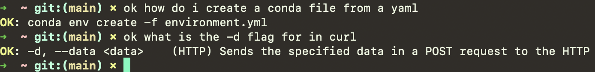

## ok

`ok` is a command line tool that uses the OpenAI Completion API to generate shell commands and other command line utilities so you don't have to leave your terminal to search for them.



## Installation

`ok` requires `json-c` (https://github.com/json-c/json-c) and libcurl (https://curl.haxx.se/libcurl/). Then, you can install `ok` with:

```bash
git clone https://github/jon-tow/ok
mkdir build; cd build; cmake ..
make; chmod 777 ok
```
